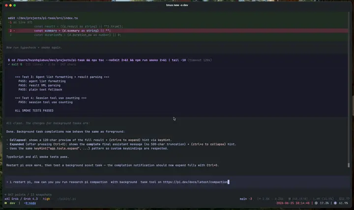

# @heyhuynhgiabuu/pi-task

Delegating task/subagent extension for [Pi](https://pi.dev). It adds a `task` tool that can run specialized subagents in foreground or background, show task progress in the TUI, and deliver background completion back to the parent assistant.

See [`docs/task-lifecycle.md`](docs/task-lifecycle.md) for JSONL polling, completion detection, result delivery, and XML formatting.

## Demo



_Auto-playing preview of the 89s walkthrough (1 fps): spawning a background subagent in a tmux pane, watching the live tool-call progress in the parent pane, and reading the final result via the session JSONL._

For the full high-quality 89s @ 56 fps version, [download the MP4](https://github.com/heyhuynhgiabuu/pi-task/releases/download/v0.2.0/demo-background-task.mp4).

## Features

- Foreground tasks: parent waits and receives the subagent result directly.
- Background tasks: parent continues, task widget shows progress, completion arrives as a follow-up.
- Tmux backend for observable subagent panes.
- HerdR and tmux terminal backends, with SDK fallback when neither is available.
- Agent frontmatter support: `model`, `thinking`, `tools`, `disallowed_tools`.
- Built-in starter agents: `scout`, `explore`, `general`, `reviewer`.
- Project/user agent overrides via `.pi/agents/*.md` or `~/.pi/agents/*.md`.

## Install

```bash
pi install npm:@heyhuynhgiabuu/pi-task
```

Latest release: https://github.com/heyhuynhgiabuu/pi-task/releases/latest

Or load locally:

`pi -e ./src/index.ts`

Restart Pi after installing or changing extension config.

## Usage

Prompt contract for every non-trivial task:
- goal: the exact outcome wanted
- non-goals: what to avoid or leave untouched
- write/read policy: whether the child may edit or must stay read-only
- stop condition: what must be true before it can stop
- verification recipe: checks to run or evidence to gather

Foreground task:

```json
{
  "agent_type": "explore",
  "description": "Find auth flow",
  "background": false,
  "prompt": "Goal: map the auth flow. Non-goals: do not edit files. Write/read policy: read-only. Stop condition: auth entrypoints, middleware, and session issuance are mapped. Verification: return file:line evidence."
}
```

Background task:

```json
{
  "agent_type": "scout",
  "description": "Research SDK docs",
  "background": true,
  "prompt": "Goal: research the latest Pi SDK extension APIs. Non-goals: no code changes. Write/read policy: read-only. Stop condition: official docs and key APIs are summarized. Verification: cite official docs."
}
```

### Graceful timeout behavior

Terminal-backed calls accept `timeout_seconds`, `timeout_grace_seconds`, and `timeout_send_escape`. The defaults are 1800 seconds, 300 seconds, and `true`.

At the soft timeout, pi-task sends Escape before the wrap-up request. This cancels standard Pi dialogs so the child can process the request. The sequence has been tested with `pi-permission-system` permission prompts and `pi-show-diffs` review prompts. Tmux and HerdR support the key injection.

Set `timeout_send_escape` to `false` to send only the wrap-up text and Enter. The pane closes if no final result arrives during the additional grace period. The default hard deadline is 2100 seconds. SDK tasks keep their existing one-shot behavior and do not receive terminal steering.

Durable specialist conversation:

```
{
  "agent_type": "scout",
  "conversation_id": "research-ai",
  "description": "Ask research assistant",
  "background": false,
  "prompt": "Continue our prior research thread. What did we conclude about retrieval evaluation?"
}
```

        `conversation_id` maps to a durable subagent run. Reused across calls
        to keep specialist memory, e.g. a reusable research assistant.
        Use `/task-sessions` to list known durable conversations.

        Stored files:

        ```
        .pi/artifacts/task-sessions.json          # conversation_id -> { task_id }
        .pi/artifacts/tasks/sessions/<task-id>/*.jsonl  # subagent session transcript/result
        .pi/task-registry.json                    # active background tasks
        .pi/task-session-history.json             # task status and session metadata
        ```

        The subagent's final assistant message in the task JSONL session is
        the result; no separate result file is required.

    Note: true conversation resume requires the tmux/CLI backend so Pi can reopen the saved subagent session. SDK fallback can run foreground or background one-shot tasks, but it cannot resume a prior Pi session.

If Pi restarts while background tasks are still running, pi-task restores them on startup. Treat restored tasks as still in flight: do not relaunch overlapping work unless you intentionally want a second competing run. Use `/task-sessions` to inspect what was restored before taking action.

## Agent precedence

When two agents have the same name, later sources override earlier ones:

1. bundled agents from this package
2. user agents: `~/.pi/agents/*.md`
3. project agents: `.pi/agents/*.md`

## Agent frontmatter

```md
---
description: Local read-only code explorer
model: opencode-go/deepseek-v4-flash
thinking: off
readonly: true
# hidden: true      # omit from task tool catalog; block invoke
# proactive: true   # listed in proactive delegation block on task tool
tools: read, grep, find, ls
disallowed_tools: edit, write
prompt_mode: append
---

# Agent instructions
```

Pi has one session parent agent; all `*.md` agents under `agents/` are **task subagents** only. Use `hidden` for internal/orchestration-only agents.

`tools:` is an explicit allowlist. If omitted, pi-task starts from the tools actually registered in the parent Pi session, then removes `disallowed_tools`. `readonly: true` always adds write/edit/apply_patch to the deny list, even when `tools:` is explicit. It does **not** deny `bash`; use explicit `tools:` or `disallowed_tools: bash` when an agent must not run shell. Recursive `task` delegation is always blocked.

Bundled agents in `agents/`: `explore`, `scout`, `general`, `reviewer`. `readonly` blocks mutating tools (write/edit/apply_patch), not `bash`.

When the target repo is not the parent session cwd (e.g. verifying the `pi-task` extension while cwd is an app), put an **absolute path** in the task `prompt` so explore/general search the right tree.

## Orchestration patterns with one tool

You do not need a separate orchestration tool for most work. Keep `task` as the only primitive and express orchestration in the prompt and calling pattern.

- Fan-out and synthesize: launch several read-only tasks in one message, then run one reviewer/synthesizer task after they complete.
- Adversarial verification: pair a producer task with a separate skeptic/verifier task using the same rubric.
- Tournament/ranking: spawn multiple candidate-producing tasks, then one comparator task that ranks them pairwise.
- Loop until done: rerun a narrowly scoped task with an explicit stop condition like "no new findings for two rounds" or "no remaining failing checks".

Keep the parent responsible for orchestration decisions and final verification. The child tasks do the work; the parent should not duplicate it while they run. Prefer improving prompts and reviewer patterns before inventing a second orchestration tool.

## Environment

| Variable | Effect |
|----------|--------|
| `PI_TASK_CHILD_NO_EXTENSIONS=1` | Child `pi` runs with `--no-extensions` (fewer startup failures in tmux subagents). |
| `PI_TASK_POLL_MS` | Background poll interval (default 2000). |
| `PI_TASK_BACKEND` | `auto` (default), `herdr`, `tmux`, or `sdk`. `auto` prefers HerdR only when Pi is already running inside an active HerdR pane, then tmux, then SDK. |
| `PI_TASK_TMUX_SPLIT` | Tmux pane orientation: `auto` (default), `horizontal` (side-by-side), or `vertical` (top/bottom). Auto uses a horizontal split when pane width is at least twice its height; otherwise it uses a vertical split. |
| `PI_TASK_TIMEOUT_SEND_ESCAPE` | Send Escape before a terminal task's soft-timeout wrap-up request. `1` enables it (default); `0` disables it. The per-task `timeout_send_escape` argument takes precedence. Other values reject the task call. |

For HerdR, install and launch HerdR separately, then start Pi inside a managed pane. pi-task requires `HERDR_ENV=1`, `HERDR_PANE_ID`, and an absolute `HERDR_SOCKET_PATH`; it never starts or installs HerdR. Each HerdR-backed task creates its own unfocused HerdR workspace in the task's working directory, so its agent pane never splits the parent workspace. `herdr integration install pi` is optional and improves lifecycle labels, but task completion still comes from Pi session JSONL. Persisted tasks validate both the socket path and HerdR terminal identity before reading, steering, or closing a pane.

### Background task failed with "Subagent pane exited"

That means the tmux pane died before a session JSONL result was available — not necessarily a tmux bug. The parent message should include session dir status and a **pane capture** when possible. Check the `task-*` split pane for extension load errors; try `PI_TASK_CHILD_NO_EXTENSIONS=1` or `background: false` for one-shot review.

## Development

```bash
npm install
npm run typecheck
npm test
npm run smoke   # requires `pi` on PATH; checks peer version
npm run build
npm pack --dry-run
```

## Notes

- Tmux is recommended for interactive observability.
- In non-tmux/headless environments, pi-task falls back to the Pi SDK backend.
- Treat subagent results as untrusted until you read artifacts/files and verify claims.
