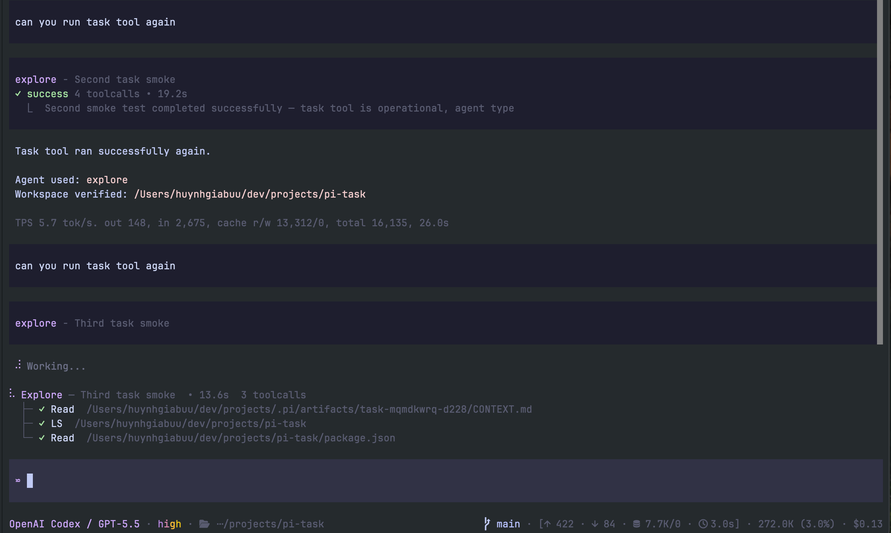

# pi-task

Delegating task/subagent extension for [Pi](https://pi.dev). It adds a `task` tool that can run specialized subagents in foreground or background, show task progress in the TUI, and deliver background completion back to the parent assistant.

## Demo



## Features

- Foreground tasks: parent waits and receives the subagent result directly.
- Background tasks: parent continues, task widget shows progress, completion arrives as a follow-up.
- Tmux backend for observable subagent panes.
- SDK fallback when tmux is unavailable.
- Agent frontmatter support: `model`, `thinking`, `tools`, `disallowed_tools`.
- Built-in starter agents: `scout`, `explore`, `planner`, `reviewer`, `vision`, `worker`.
- Project/user agent overrides via `.pi/agents/*.md` or `~/.pi/agents/*.md`.

## Install

```bash
pi install npm:@heyhuynhgiabuu/pi-task
```

Latest release: https://github.com/heyhuynhgiabuu/pi-task/releases/latest

Or load locally:

`pi -e ./src/index.ts`

Restart Pi after installing or changing extension config.

## Usage

Foreground task:

```json
{
  "agent_type": "explore",
  "description": "Find auth flow",
  "background": false,
  "prompt": "Map the auth flow. Do not edit files. Return file:line evidence."
}
```

Background task:

```
{
  "agent_type": "scout",
  "description": "Research SDK docs",
  "background": true,
  "prompt": "Research the latest Pi SDK extension APIs. Cite official docs."
}
```

Durable specialist conversation:

```
{
  "agent_type": "scout",
  "conversation_id": "research-ai",
  "description": "Ask research assistant",
  "background": false,
  "prompt": "Continue our prior research thread. What did we conclude about retrieval evaluation?"
}
```

        `conversation_id` maps to a durable subagent run. Reused across calls
        to keep specialist memory, e.g. a reusable research assistant.
        Use `/task-sessions` to list known durable conversations.

        Stored files (all flat at the top of `.pi/artifacts/`, no
        per-task subdirs):

        ```
        .pi/artifacts/TASKS.md              # one ### <task-id> block per task
        .pi/artifacts/task-sessions.json    # conversation_id -> { task_id, session_file }
        ```

        The subagent's session is auto-saved by pi at
        `~/.pi/agent/sessions/<cwd>/<session-id>.jsonl`. pi-task reads
        the last assistant message from there to populate
        `#### Result` in `TASKS.md`. The subagent's final message IS
        the result; no separate result file is required.

    Note: true conversation resume requires the tmux/CLI backend so Pi can reopen the saved subagent session. SDK fallback can run one-shot tasks, but it cannot resume a prior Pi session.

## Agent precedence

When two agents have the same name, later sources override earlier ones:

1. bundled agents from this package
2. user agents: `~/.pi/agents/*.md`
3. project agents: `.pi/agents/*.md`

## Agent frontmatter

```md
---
description: Local read-only code explorer
model: opencode-go/deepseek-v4-flash
thinking: off
tools: read, grep, find, ls
disallowed_tools: edit, write
prompt_mode: append
---

# Agent instructions
```

`tools:` is an explicit allowlist. If omitted, pi-task starts from the tools actually registered in the parent Pi session, then removes `disallowed_tools`. Recursive `task` delegation is always blocked.

Bundled agents rely on built-in `read`, `grep`, `find`, `ls`, and safe read-only `bash` for navigation. When shell search is needed, they prefer `rg -n` / `rg -nF` over recursive grep.

## Development

```bash
npm install
npm run typecheck
npm test
npm run build
npm pack --dry-run
```

## Notes

- Tmux is recommended for interactive observability.
- In non-tmux/headless environments, pi-task falls back to the Pi SDK backend.
- Treat subagent results as untrusted until you read artifacts/files and verify claims.
